# Dokumentasi Tugas Praktikum 1 bagian 07 Layout dan Navigasi
## Layout dan navigasi
Pada codelab ini, Saya akan mempelajari konsep dan praktik untuk dasar-dasar framework Flutter dengan menerapkan layout dan navigasi.

### Tujuan Praktikum
Praktikum ini memiliki beberapa tujuan, antara lain:
- menerapkan jenis-jenis layout
- menerapkan navigasi
- menerapkan routing

### Sumber daya yang dibutuhkan
Sebelum mengerjakan praktikum ini, saya akan menyiapkan beberapa kebutuhan terlebih dahulu, kebutuhan tersebut antara lain:
- PC atau Laptop
- Koneksi internet
- Chrome Browser
- Emulator Android

### Pengetahuan yang wajib dimiliki
- Algoritma dan Pemrograman Dasar
- Pemrograman Berorientasi Objek
- Bahasa Pemrograman Dart

## konsep Layout di Flutter
Flutter merupakan framework pengembangan aplikasi mobile yang menggunakan widget sebagai struktur utama dalam tampilan antarmuka-nya. Setiap elemen-elemen mulai dari teks, icon, sampai gambar dibuat sebagai widget, termasuk tata letaknya seperti baris, kolom, serta kontainer yang tidak terlihat secara langsung. Praktikum ini memiliki tujuan untuk mengenal konsep layout di Flutter melalui beberapa praktikum. Dengan melakukan praktikum ini, saya berharap akan mampu membuat tampilan aplikasi yang lebih terorganisis, rapi serta fungsional.

## Praktikum 1: Membangun Layout di Flutter
### Langkah 1 membuat projek baru
langkah yang pertama kali saya lakukan adalah dengan membuat projek fluter baru, disini saya membuat projek tersebut menggunakan cmd saja. sebagai berikut:

setelah projek terbuat sebagai berikut:

### Langkah 2
selanjutnya saya masuk ke folder tersebut untuk bisa mengaksesnya dan menggunakan code. di cmd yang nantinya akan langsung masuk ke code editor:

setelah itu maka saya akan langsung dialihkan ke code editor

setelah itu saya membuka folder lib

selanjutnya saya membuat kode material sebagai berikut:

jika dijalankan maka akan tertampil sebagai berikut

### Langkah 3
Pada tahap ini, saya melakukan analisis dengan cara memecah tampilan aplikasi menjadi beberapa bagian agar lebih mudah untuk saya susun. saya membagi layout utama menjadi empat elemen yang berbeda yang saya susun secara vertikal menggunakan widget Column: satu gambar di bagian atas, dua baris (judul dan tombol), dan satu blok teks deskripsi. Saya menganalisis setiap baris secara terpisah. pada baris judul ini saya pisah menjadi tiga bagian yaitu kolom nama wisata dan lokasi, ikon bintang, dan angka rating. agar komom nama wisata dan lokasinya memiliki jarak yang cukup, saya menggunakan widget Expanded. Dengan cara ini, harapannya saya bisa menyusun tampilan secara bertahap dari elemen elemen kecil ke besar, sehingga kode yang saya tulis tetap rapi dan mudah dipahami.

### Langkah 4
Setelah menganalisa bagian bagian layout, selanjjtnya saya mulai membuat bagian bagian widget dan yang pertama saya buat adalah bari judul. berikut merupakan tahapannya:
yang pertama saya lakukan adalah membuat kode widget sebagai berikut:

[kode judul widget](lib/main1_4.dart)
setelah membuat kode seperti diatas saya akan mencoba menjalankannya dan melihatnya di emulator. setelah saya menjalankannya tampilannya akan sebagai berikut:

bisa dilihat dari tampilan diatas bawasannya terdapat nama wisata, lokasi wisata dibawahnya, bintang dan angka rating. disini saya memisahkan baris menjadi 3 kolom terlebih dahulu lalu untuk kolom yang pertama saya bagi menjadi 2 baris.

## Praktikum 2: Implementasi Button Row
setelah membuat baris judul seperti diatas, selanjutnya saya akan membuat baris tombol yang akan menyimpan ikon-ikon yang didalamnya ada labelnya juga. langkah langkah untuk membuatnya sebagai berikut:

### Langkah 1
karena kode untuk tombol tombol ini sama, jadi disini saya akan membuat method pembantu terlebih dahulu, method ini akan memiliki parameter warna, ikon dan text untuk label. sehingga nantinya kita hanya perlu mengisikan ketiga hal tersebut saja. berikut merupakan kodenya:
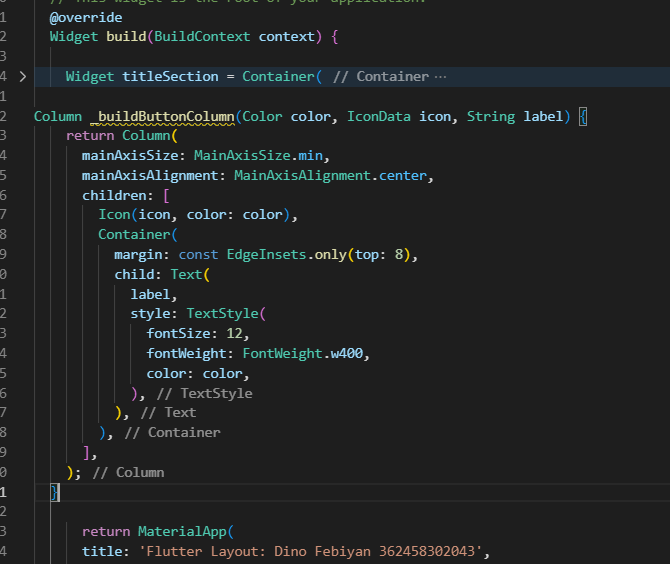
### Langkah 2
setelah membuat method seperti diatas, selanjutnya saya akan mengisi parameter pada method tersebut. karena disini saya akan membuat 3 button, sehingga saya akan mengisikannya 3 kali. selain itu saya juga akan membuat kode yang menyimpan variabel warna agar saya bisa langsung mengambil warnanya dari variabel tersebut tanpa perlu mengisinya lagi sebagai berikut:
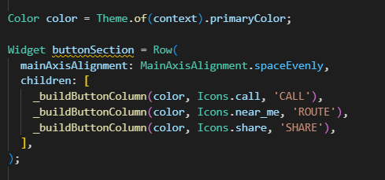
pada kode diatas saya masukkan sebagai widget agar nantinya saya bisa langsung memangggil saja.
### Langkah 3
setelah membuat kode widget yang mengisi paramater method seperti diatas, untuk menggunakannya saya akan memanggilnya dari body seperti berikut:
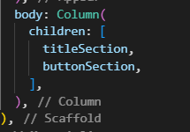
setelah memanggil lewat body seperti diatas, selanjutnya saya akan menjalankan programnya agar bisa melihat hasil tampilannya. sebagai berikut:
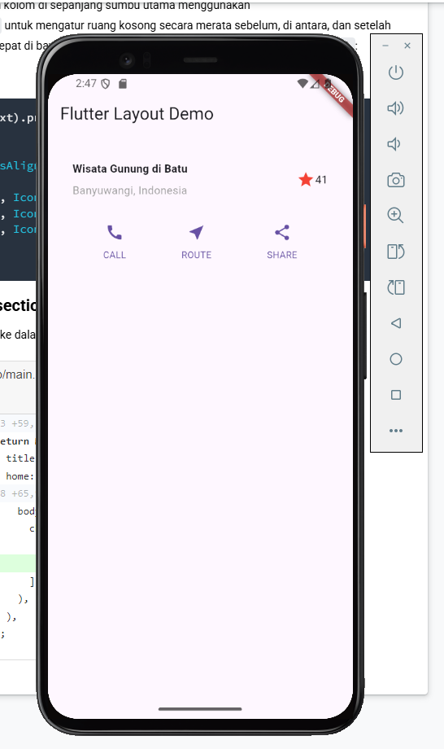
dari gambar diatas bisa dilihat bahwa terdapat 3 tombol baru dalam 1 baris yang memiliki desain yang sama.

## Praktikum 3: Implementasi Text Section
setelah membuat button section seperti diatas, selanjutnya saya akan membuat text section untuk membuat bagian deskripsi. pada bagian ini saya menggunakan softtwrap agar baris teksnya bisa keseluruh bagian kolom atau memenuhi kolom. berikut merupakan langkah langkahnya:

### Langkah 1
yang pertama saya lakukan adalah membuat widget textsection. pada widget ini saya akan membuat bagian teks yang mana teks ini akan saya masukkan kedalam container seperti berikut:
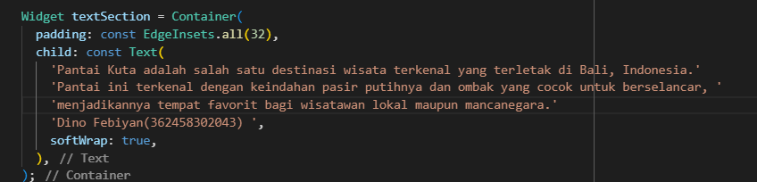
### Langkah 2
setelah membuat kode seperti diatas, selanjutnya saya akan memanggilnya lewat body seperti berikut:
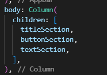

setelah memanggilnya lewat body seperti diatas, selanjutnya saya akan mencoba menjalankannya sebagai berikut:
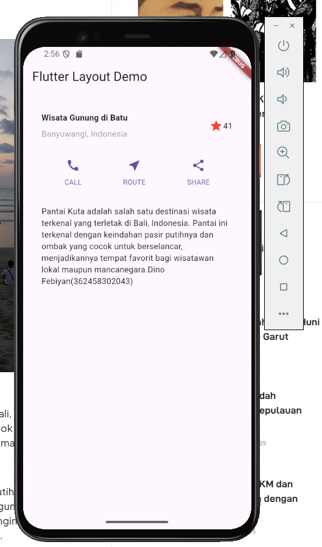
bisa dilhat bahwasannya teks akan memenuhi kolom seperti yang ditampilkan diatas.

## Praktikum 4: Implementasi Image Section
setelah membuat widget textsection seperti diatas, selanjutnya saya akan mencoba membuat section terakhir yaitu image section. pada image section ini saya akan menampilkan gambar yang akan saya ambil dari image asset. langkah langkahnya seperi berikut:

### Langkah 1
pertama tama saya akan menambahkan gambar ke image assets terlebih dahulu, namun sebelum itu saya akan membuat foldernya terlebih dahulu karena folder assets/image ini belum ada pada template flutter. sehingga untuk memakainya saya perlu membuat folder tersebut terlebih dahulu. sebagai berikut:
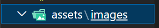
setelah itu saya akan memasukkan gambar berikut:
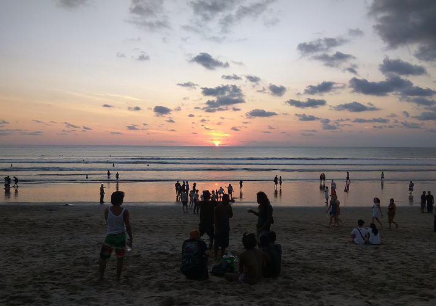
setelah memiliki gambar, saya akan memasukkannya kedalam folder image sebqagai berikut:
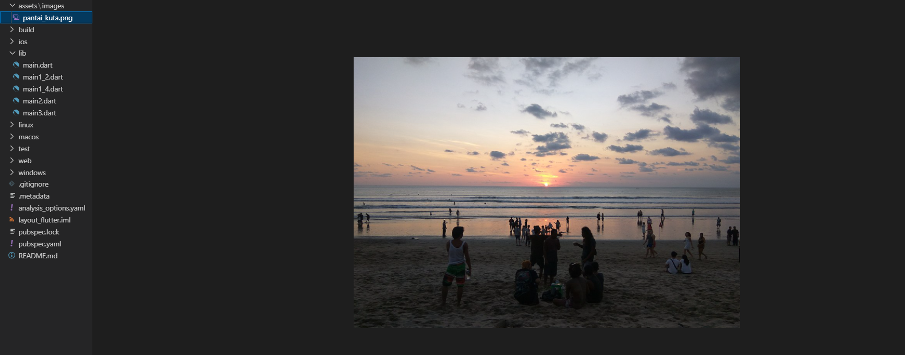
setelah menambahkan gambar kedalam folder, selanjutnya saya akan menambahkan dependency di pubspec yaml agar gambar yang sebelumnya saya taruh bisa diakses dari file lain sebagai berikut:
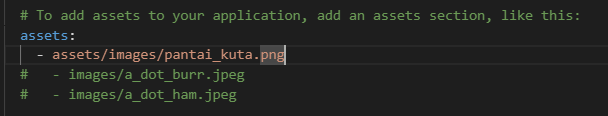
setelah menambahkan dependencie, selanjutnya saya akan menjalankan flutter pubget agar perubahan yang saya lakukan di pubspec yaml bisa terlihat dan bisa diproses seperti berikut:
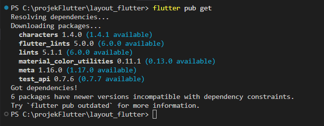

### Langkah 2
setelah itu, saya akan menambahkan gambar tersebut kedalam bodym dusubu sata juga melakukan style dengan menggunakan boxfit.cover agar bisa membesarkan gambar ke deluruh layar seperti berikut:
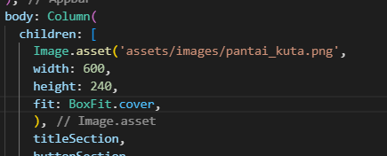

### Langkah 3
setelah menambahkan gambar ke body, selanjutnya saya akan mengubah semua elemen menjadi listview karena listview ini akan membuat tampilan menjadi bisa discrol jika isi didalamnya melebihi ukuran layar seperti berikut:
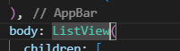

setelah itu, saya akan mencoba menjalankannya untuk melihat kira kira bagaimana tampilannya
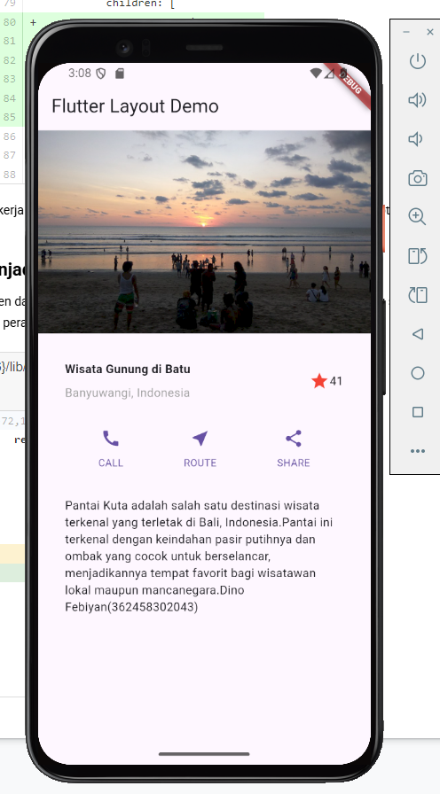

langkah langkah diatas merupakan seluruh langkah langkah yang saya lakukan untuk menjalankan praktikum ini. terakhir saya akan memperbaiki tampilannya agar menjadi lebih senada seperti berikut:
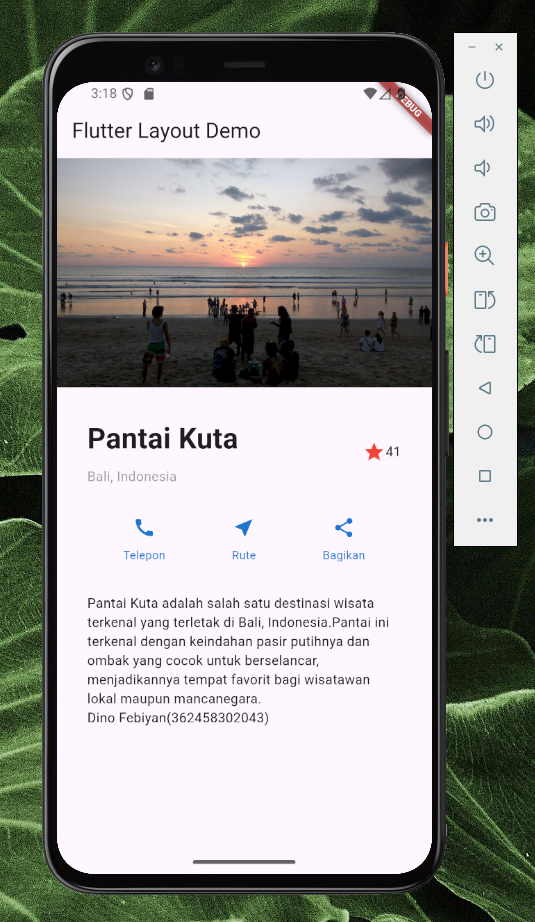

## Kesimpulan
Melalui rangkaian praktikum ini, saya telah memahami dan mengimplementasikan konsep dasar layout dalam Flutter. Praktikum mencakup penyusunan layout menggunakan widget seperti Column, Row, dan ListView, serta pengaturan tampilan gambar dengan BoxFit. Saya juga mempelajari cara membuat tampilan yang responsif dan rapi dengan memanfaatkan konsep widget yang ada didalam flutter.