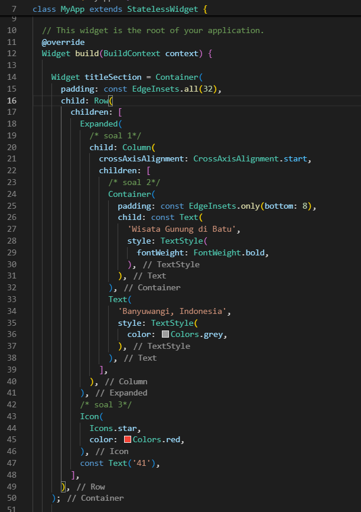

# Dokumentasi Tugas Praktikum 1 bagian 07 Layout dan Navigasi
## Layout dan navigasi
Pada codelab ini, Saya akan mempelajari konsep dan praktik untuk dasar-dasar framework Flutter dengan menerapkan layout dan navigasi.

### Tujuan Praktikum
Praktikum ini memiliki beberapa tujuan, antara lain:
- menerapkan jenis-jenis layout
- menerapkan navigasi
- menerapkan routing

### Sumber daya yang dibutuhkan
Sebelum mengerjakan praktikum ini, saya akan menyiapkan beberapa kebutuhan terlebih dahulu, kebutuhan tersebut antara lain:
- PC atau Laptop
- Koneksi internet
- Chrome Browser
- Emulator Android

### Pengetahuan yang wajib dimiliki
- Algoritma dan Pemrograman Dasar
- Pemrograman Berorientasi Objek
- Bahasa Pemrograman Dart

## konsep Layout di Flutter
Flutter merupakan framework pengembangan aplikasi mobile yang menggunakan widget sebagai struktur utama dalam tampilan antarmuka-nya. Setiap elemen-elemen mulai dari teks, icon, sampai gambar dibuat sebagai widget, termasuk tata letaknya seperti baris, kolom, serta kontainer yang tidak terlihat secara langsung. Praktikum ini memiliki tujuan untuk mengenal konsep layout di Flutter melalui beberapa praktikum. Dengan melakukan praktikum ini, saya berharap akan mampu membuat tampilan aplikasi yang lebih terorganisis, rapi serta fungsional.

## Praktikum 1: Membangun Layout di Flutter
### Langkah 1 membuat projek baru
langkah yang pertama kali saya lakukan adalah dengan membuat projek fluter baru, disini saya membuat projek tersebut menggunakan cmd saja. sebagai berikut:

setelah projek terbuat sebagai berikut:

### Langkah 2
selanjutnya saya masuk ke folder tersebut untuk bisa mengaksesnya dan menggunakan code. di cmd yang nantinya akan langsung masuk ke code editor:

setelah itu maka saya akan langsung dialihkan ke code editor

setelah itu saya membuka folder lib

selanjutnya saya membuat kode material sebagai berikut:

jika dijalankan maka akan tertampil sebagai berikut

### Langkah 3
Pada tahap ini, saya melakukan analisis dengan cara memecah tampilan aplikasi menjadi beberapa bagian agar lebih mudah untuk saya susun. saya membagi layout utama menjadi empat elemen yang berbeda yang saya susun secara vertikal menggunakan widget Column: satu gambar di bagian atas, dua baris (judul dan tombol), dan satu blok teks deskripsi. Saya menganalisis setiap baris secara terpisah. pada baris judul ini saya pisah menjadi tiga bagian yaitu kolom nama wisata dan lokasi, ikon bintang, dan angka rating. agar komom nama wisata dan lokasinya memiliki jarak yang cukup, saya menggunakan widget Expanded. Dengan cara ini, harapannya saya bisa menyusun tampilan secara bertahap dari elemen elemen kecil ke besar, sehingga kode yang saya tulis tetap rapi dan mudah dipahami.

### Langkah 4
Setelah menganalisa bagian bagian layout, selanjjtnya saya mulai membuat bagian bagian widget dan yang pertama saya buat adalah bari judul. berikut merupakan tahapannya:
yang pertama saya lakukan adalah membuat kode widget sebagai berikut:

[kode judul widget](lib/main1_4.dart)
setelah membuat kode seperti diatas saya akan mencoba menjalankannya dan melihatnya di emulator. setelah saya menjalankannya tampilannya akan sebagai berikut:

bisa dilihat dari tampilan diatas bawasannya terdapat nama wisata, lokasi wisata dibawahnya, bintang dan angka rating. disini saya memisahkan baris menjadi 3 kolom terlebih dahulu lalu untuk kolom yang pertama saya bagi menjadi 2 baris.

## Praktikum 2: Implementasi Button Row
setelah membuat baris judul seperti diatas, selanjutnya saya akan membuat baris tombol yang akan menyimpan ikon-ikon yang didalamnya ada labelnya juga. langkah langkah untuk membuatnya sebagai berikut:

### Langkah 1

### Langkah 2
### Langkah 3

## Praktikum 3: Implementasi Text Section
### Langkah 1
### Langkah 2

## Praktikum 4: Implementasi Image Section
### Langkah 1
### Langkah 2
### Langkah 3